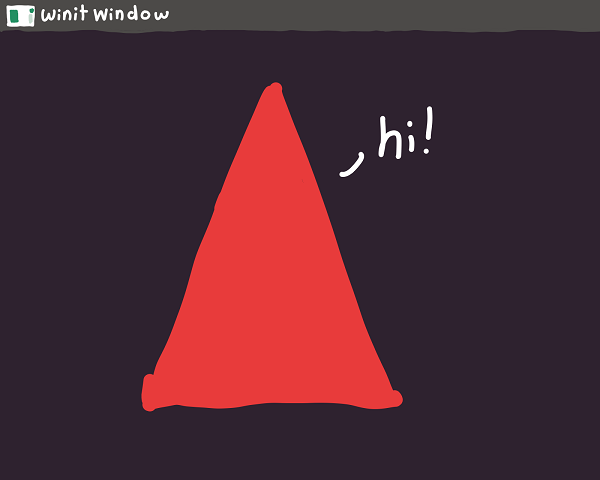

# Drawing an Extremely Cool Triangle 
> **Created:** October 31st, 2021

This is an extremely simple program that literally just draws a triangle *with [glium](https://glium.github.io/glium/book/)*


# Explanation
## Vertex Implementation
Derive copy and clone, then create a vertex struct with a position array of two 32 bit floats, lastly call the implement vertex macro

## Main
### Event Loop Setup
Create a mutable (specifying `mut` means we are allowed to change it) `glutin::event_loop::EventLoop`

### Window and Context Builders
Create a `glutin::window::WindowBuilder` and a `glutin::ContextBuilder` 

### Create the Display
Create a `Display` WindowBuilder, ContextBuilder, and a reference to the EventLoop (use an `&` to indicate that its a reference) then call `.unwrap()` on it

### Event Handler
Call `.run()` on our `EventLoop` and pass an event handler like [`move |event, _, control_flow| {}`](https://doc.rust-lang.org/std/keyword.move.html)

## Shape
- Create a `vec![]` and give it three Vertexes of our soon to be triangle
- Its worth noting that our window is two units wide and two units tall so the center is `(0, 0)`
- Create a `VertexBuffer`, give it **references** to our display and shape, then call `.unwrap()` on it
- Create a dummy marker for our indices `glium::index::NoIndices(glium::index::PrimitiveType::TrianglesList)`

## Shaders
These shaders are assigned just like any other string except you put in `r#` before and after the quotes
### Vertex Shader
```glsl
#version 140
in vec2 position;
void main() {
    gl_Position = vec4(position, 0.0, 1.0);
}
```
### Fragment Shader
```glsl
#version 140
out vec4 color;
void main() {
    // the color here is in rgba; set it to whatever you want
    color = vec4(1.0, 0.0, 0.0, 1.0);
}
```

### Program
Create a `Program::from_source()` and pass it a **reference** to our display, our vertex shader, our fragment shader, our geometry shader (`None`) then call `.unwrap()` on it


## Drawing
- Create a mutable target and assign it to our display variable's `.draw()`
- Clear our targets color `.clear_color(R, G, B, A)`
- Finally, lets draw everything. Call our target's `.draw()` and pass **references** to our vertex buffer, indices, program, uniforms (none so we can just pass `&glium::uniforms::EmptyUniforms`), and draw parameters (default so we can just pass `&Default::default()`). Finally call `.unwrap()` on it
- Call `.unwrap()` on our target's `.finish()`

## Ensure Our Window Stays Open
Since we don't want our window to instantly close lets make sure it doesn't unless we want it to

### Next Frame
- Create an `Instant` and just assign it to `Instant::now()` plus ` Duration::from_nanos(16_666_667)`
- Dereference (with `*`) our `control_flow` from earlier and set it equal to `ControlFlow::WaitUntil(`the instant we just made earlier`)`
### Match
- Create a [`match`](https://doc.rust-lang.org/rust-by-example/flow_control/match.html) statement with `ev` from earlier
- Our first arm should be `Event::WindowEvent { event, .. } => match event {}`
    - Our first arm in this inner match statement should be `WindowEvent::CloseRequested => {}`
        - in this block we can set a dereferenced `control_flow` equal to `ControlFlow::Exit` and `return`
    -  And our last should be `_ => return,`
- Our last arm should just be `_ => (),`
